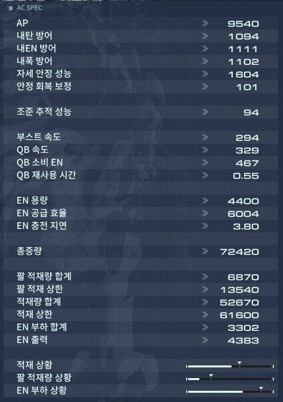

# AC-Fangame

# 목차
* [키세팅](#키세팅)
* [디스플레이](#디스플레이)
* [AC 스펙](#ac-스펙)
* [파츠 별 스펙](#파츠-별-스펙)
* [ToDo List](#todo-list)

# 키세팅
### 이동
w, a, s, d

### 부스트
tab

### 퀵부스트
shift

### 점프
space

### 오버드부스트
ctrl

### 시점조작
마우스

### 락온
휠 클릭

### 공격
좌클릭, 우클릭

### 보조무기
q, e

### 회복
c

### 상호작용
f

### 스캔모드
v

### 장비해제
p

# 디스플레이

- (1) AP: 좌측 하단에 표시된 AP(Armor Point)의 값. 공격을 받으면 감소하며, 0이 되면 기체가 파괴되고 미션에 실패한다.
- (2) EXPANSION: 좌측 하단에 표시된 익스팬션의 사용 가능 횟수로, 익스팬션을 사용할 시 숫자가 감소한다.
- (3) REPAIR: 좌측 하단에 표시된 AP를 복구하는 회복 장치의 남은 사용 가능 횟수가 표시되어있다.
- (4) SCAN: 좌측 하단에 표시된 회색 게이지로, 스캔을 사용할 시 소모되고 시간이 지남에 따라 회복한다.
- (5) 스태거 게이지: 중앙 하단의 노란색 게이지로, 공격을 받으면 중앙에서 바깥쪽을 향해 좌우 대칭으로 증가하고 끝까지 도달하면 붉어지며 '스태거(Stagger)' 상태가 되어 짧은 시간 동안 움직임이 불가능해지고 받는 피해량이 대폭 증가한다.
- (6) EN 게이지: 중앙 하단의 회색 게이지로, 부스트를 사용할 시 소비되어 오른쪽에서 왼쪽으로 이동한다. 잔량이 낮으면 붉게 변하며, 끝까지 사용할 시 붉은색으로 점멸하며 부스트 사용이 불가능하게 되고 이는 시간이 지남에 따라 회복한다.
- (7) 방향계: 중앙 최하단에 위치하여 자신의 위치를 중심으로 적과 아군의 위치를 나타낸다. 적은 붉은색, 아군은 녹색 사각형의 아이콘으로 표시된다. 4 시리즈까지의 작품에서 있었던 미니맵의 역할을 대신하는 요소이며, 동시에 N 시리즈까지의 작품에서 있었던 방향계를 계승한 요소이기도 하다.
- (8) 무장 정보: 우측 하단에 위치한 무장의 잔탄을 표시하는 정보로, 각각 RA(오른팔)/LA(왼팔)/RB(오른쪽 등)/LB(왼쪽 등)에 대응된다. 상단의 숫자가 현재 탄창 탄약량/사용 횟수, 하단의 숫자가 전체 탄약량으로 전부 소모할 시 'RELOAD' 표시된다. 하단 숫자가 없는 무장은 탄창이 없는 무기로 재장전이 필요하지 않다. 일부 무기는 연속해서 사용시 총신이 과열되어 'OVERHEAT'가 표시되며 일정시간 동안 해당 무기를 사용할 수 없다.
- (9) 속도계: 좌측에 위치하여 현재 기체의 속도를 상하 스크롤 정보로 나타낸다.
- (10) 고도계: 우측에 위치하여 현재 기체의 높이를 상하 스크롤 정보로 나타낸다.
- (11) 잔탄 정보: 록온 UI의 테두리에 표시되어 현재 사용하고 있는 무장의 잔탄 정보를 표시한다. 무장 정보와 같은 기능이지만 시선을 돌리지 않고 항상 잔탄을 확인할 수 있으며, 탄을 소비하면 게이지가 위에서 아래로 감소하고 0이 되면 붉게 변하여 재장전을 나타낸다. 오버히트가 있는 무기 역시 붉은 색 게이지로 얼마나 과열되었는지 표시된다. 차지가 가능한 무기의 경우엔 발사키를 길게 누르면 노란색 게이지로 얼마만큼 충전되었는지 표시한다. 좌측 바깥이 LA, 좌측 안쪽이 LB, 우측 바깥이 RA, 우측 안쪽이 RB를 의미한다.
- (12) 적과의 거리: 록온 UI의 중앙에 거리계가 표시되어 현재 자신과 적과의 거리를 나타낸다.
- (13) 미사일 락온: 록온 UI의 중앙의 빨간색 조준점이 있고 그 바깥부분의 노란색으로 호를 그린 게이지가 미사일 락온이다. 좌상단이 왼쪽 어깨, 우상단이 오른쪽 어깨, 좌하단 왼손, 우하단이 오른손 무기에 대응한다. 노란색 게이지가 뜨면 미사일 록온이 완료되었다는 뜻이며 옆에 숫자는 해당 적에게 얼마만큼 발사할지를 알려준다.
- (14) 적 스태거/AP 게이지: 록온 UI 상단의 노란색 게이지가 적의 스태거 게이지, 하단의 회색 게이지가 적의 AP를 표시한다.
- (15) 보스 스태거/AP 게이지: 보스가 출현하였을 때 표시되며, 상술한 적 스태거/AP 게이지와 기능은 같지만 화면 상단에 나타나기 때문에 쉽게 확인할 수 있다. 적의 엠블렘이 있다면 엠블렘도 표시한다.
- (16) 목적: 현재 목표가 화면 좌측 상단에 항상 표시된다.

# AC 스펙

- AP :
  - 기체의 내구 성능    
  - 모든 프레임 파츠의 AP를 합산한 수치
- 내탄 방어 : 
  - 실탄 속성 데미지에 대한 방어 성능
  - 모든 프레임 파츠의 내탄 방어를 합산한 수치
- 내EN 방어 : 
  - EN 속성 데미지에 대한 방어 성능
  - 모든 프레임 파츠의 내EN 방어를 합산한 수치
- 내폭 방어 : 
  - 폭발/연소 속성 데미지에 대한 방어 성능
  - 모든 프레임 파츠의 내폭 성능을 합산한 수치
- 자세 안정 성능 : 
  - ACS의 부하 한계
  - 모든 프레임 파츠의 자세 안정 성능을 합산한 수치
  - 이 수치가 클수록 쉽게 스태거에 걸리지 않는다
- 안정 회복 보정 : 
  - ACS의 부하 처리 성능
  - 기체의 총중량이 가벼울수록 이 수치가 커지며 잔류한 충격의 회복이 빨라진다
- 조준 추적 성능 : 
  - 조준 시의 조준 추적 성능
  - 이 수치가 클수록 움직이는 적을 사격으로 맞히기 쉬워진다
  - 팔의 사격 무기 적성이 높을수록 성능이 향상된다
- 부스트 속도 : 
  - 부스트 이동의 최고 속도
  - 부스터의 추진력이 높고 기체의 총중량이 가벼울수록 성능이 향상된다
- QB 속도 : 
  - 퀵 부스트의 초속 성능
  - 부스터의 QB 추진력이 높고 기체의 총중량이 가벼울수록 성능이 향상된다
- QB 소비 EN : 
  - 퀵 부스트로 소비되는 EN
  - 부스터의 QB 소비 EN이 낮고, 코어 파츠의 부스터 효율 보정이 높을수록 소비량이 줄어든다
- QB 재사용 시간 : 
  - 퀵 부스트 재사용 시간
  - 이 수치가 작을수록 퀵 부스트를 연속으로 발동할 수 있다
  - 기체의 총중량이 부스터의 QB 재사용 보장 중량을 초과하면 성능이 저하된다
- EN 용량 : 
  - 사용 가능한 EN의 총량
  - 이 수치가 클수록 EN 소비 액션을 많이 사용할 수 있다
- EN 공급 효율 : 
  - EN이 기체에 공급될 때의 속도 효율
  - 이 수치가 클수록 EN 회복이 빨라진다
  - 제너레이터의 EN 출력이 높고 기체의 EN 부하 합계가 낮을수록 효율이 향상된다
- EN 충전 지연 : 
  - EN이 충전되는데 걸리는 지연 시간
  - 이 수치가 작을수록 EN 소비 액션을 사용한 뒤의 EN 회복 개시 속도가 빨라진다
  - 제너레이터의 EN 충전 성능과 코어 파츠의 공급 보정이 높을수록 성능이 향상된다
- 총중량 : 
  - 전 파츠의 총중량
  - 모든 파츠의 중량을 합산한 수치
  - 기체의 이동속도에 영향을 준다
- 팔 적재량 합계 : 
  - 팔의 적재 중량
  - 양손 무기의 중량을 합산한 수치
- 팔 적재 상한 :
  - 팔의 안정적인 구동이 보장되는 중량 상한
  - 이 수치가 클수록 양손 무기를 쉽게 다룰 수 있게 되며 상한을 초과하더라도 조준 추적 성능/반동 제어의 저하가 쉽게 발생하지 않는다
- 적재량 합계 : 
  - 기체의 적재 중량
  - 다리를 제외한 모든 파츠의 중량을 합산한 수치
- 적재 상한 : 
  - 다리가 지탱할 수 있는 중량 상한
  - 이 수치가 클수록 적재량에 여유가 생기며 중량 파츠를 다수 탑재할 수 있다
- EN 부하 합계 : 
  - 기체의 EN 부하
  - 모든 파츠의 EN 부하를 합산한 수치
  - 이 수치가 제너레이터의 EN 출력을 초과하면 출격할 수 없다
- EN 출력 : 
  - 기체의 EN 출력
  - 이 수치가 클수록 고부하 파츠를 다수 탑재할 수 있으며 여유가 있을수록 EN 회복 속도가 빨라진다
  - 제너레이터의 EN 출력과 코어 파츠의 출력 보정이 높을수록 성능이 향상된다
- 적재 상황 : 
  - 적재 상한 대비 적재 중량의 비율
  - 상한을 초과하면 출격할 수 없게 되지만 OS 강화 [웨이트 컨트롤]을 통해 제한을 해제할 수 있다
- 팔 적재량 상황 : 
  - 팔의 적재량 상한 대비 양손 무기 중량의 비율
  - 상한을 초과하면 조준 추적 성능 및 반동 제어가 저하된다
- EN 부하 상황 : 
  - EN 출력 대비 EN 부하의 비율
  - 상한을 초과하면 출격할 수 없다

# 파츠 별 스펙

## 프레임
### 공통
- AP
- 중량
- EN 부하
- 내탄 방어
- 내EN 방어
- 내폭 방어

### 머리
- 자세 안정 성능
- 시스템 복원 성능
- 스캔 거리
- 스캔 지속 시간
- 스캔 대기 시간

### 코어
- 자세 안정 성능
- 부스터 효율 보정
- 제너레이터 출력 보정
- 제너레이터 공급 보정

### 팔
- 팔 적재 상한
- 반동 제어
- 사격 무기 적성
- 근접 무기 적성

### 다리
- 자세 안정 성능
- 적재 상한
- 수평 도약 성능
- 수직 도약 성능

### 다리(탱크)
- 자세 안정 성능
- 적재 상한
- 주행 성능
- 고속 주행 성능
- 추진력
- 상승 추진력
- 상승 소비 EN
- QB 추진력
- QB 분사 시간
- QB 소비 EN
- QB 재사용 시간
- QB 재사용 보증 중량
- AB 추진력
- AB 소비 EN

# ToDo List

1. 플레이어, 몹, 오브젝트의 클래스 정의
   1. 데미지, 이동, 스텟, 타겟팅, 파괴 관련 인터페이스 생성 (2024-04-08)
   2. 공격, 입력 관련 인터페이스 생성 (2024-04-09)
   3. 인터페이스 변수, 메소드 작성 (2024-04-09)
2. 플레이어의 애니메이션 수집
3. 몹이 플레이어 앞뒤에 있는지 판별하는 기능 구현
4. 몹이 풀레이어 시야 범위에 있는지 판별하는 기능 구현
5. 몹이 플레이어 좌우에 있는지 판별하는 기능 구현
6. 절두체 컬링으로 몹 최적화하기